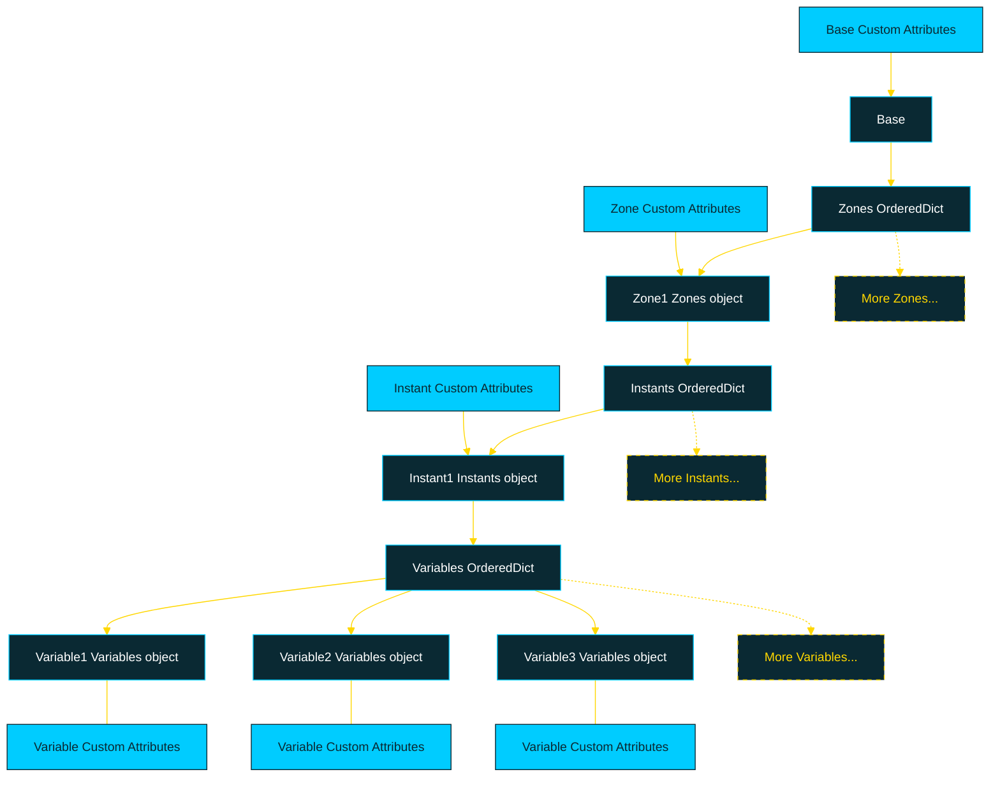

<p align="center">
  <strong style="font-size: 24px; color: red;">🚧 Work in Progress 🚧</strong>
</p>

<p align="center">
  
</p>

[](LICENSE)

# About
This repository provides a Python-based API for post-processing large-scale data. The API is designed to handle multi-dimensional data across various zones, time instants, and variables, offering scalable and parallelized computation capabilities.

## Table of Contents

- [Features](#features)
- [Dataset structure](#Dataset-structure)
- [Installation](#installation)
- [Documentation](#Documentation)
- [Usage](#usage)
  - [Basic Example](#basic-example)

## Features

- **Organized Data Structure**: Manage multi-dimensional data across zones (e.g., physical regions), instants (e.g., time steps), and variables (e.g., physical quantities like velocity or pressure).
- **Efficient Data Handling**: Relies on [HDF5](https://docs.alliancecan.ca/wiki/HDF5/fr) for efficient storage and access to multi-dimensional data, ensuring high performance and flexibility.
- **Efficient Computation**: Uses [Dask](https://www.dask.org/) arrays to handle large datasets lazily, triggering computation only when needed.
- **Parallelization**: Perform computations across zones and instants using **ThreadPoolExecutor** for multi-threaded processing.
- **Custom Metadata**: Attach custom attributes (metadata) to zones, instants, or variables for easy categorization and filtering.
- **Expression-Based Computation**: Dynamically compute new variables using literal expressions (e.g., `"new_var = var1 * var2"`).

## Dataset structure

Orion's data structure is heavily inspired by the hierarchical data organization of both [HDF5](https://docs.alliancecan.ca/wiki/HDF5/fr) and [CGNS](https://cgns.github.io/)



## Installation

1. Clone the repository:

    ```bash
    git clone https://github.com/TSaouchi/Orion.git
    ```

2. Navigate to the project directory:

    ```bash
    cd Orion
    ```

3. Install the required dependencies:

    ```bash
    pip install -r requirements.txt
    ```

## Documentation 

The project documentation is generated using [Sphinx](https://www.sphinx-doc.org/en/master/) and can be accessed via the **Read_The_Docs.html** portal.

## Usage

### Basic Example

[Example](Documentation\source\_static\pictures\Basic_Example.ipynb)

# Author
The Orion library was created and is maintained - in my free time ;) - by Toufik Saouchi
