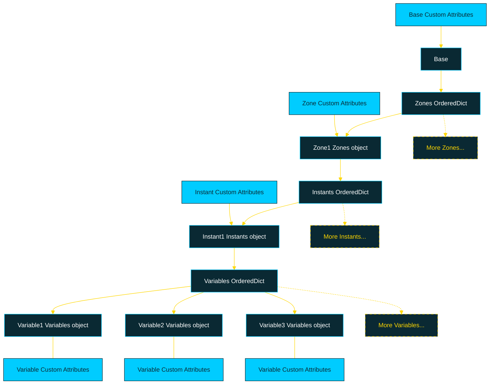

<p align="center">
  <strong style="font-size: 24px; color: red;">🚧 Work in Progress 🚧</strong>
</p>

<p align="center">
  
</p>

[](LICENSE)

# About
This repository contains a Python-based framework for post-processing large-scale data. The framework is built to handle multi-dimensional data across different zones, instants, and variables, offering scalable and parallelized computation.

## Table of Contents

- [Features](#features)
- [Dataset structure](#Dataset-structure)
- [Installation](#installation)
- [Documentation](#Documentation)
- [Usage](#usage)
  - [Basic Example](#basic-example)
- [License](#license)

## Features

- **Organized Data Structure**: Manage multi-dimensional data across zones (e.g., physical regions), instants (e.g., time steps), and variables (e.g., physical quantities like velocity or pressure).
- **Efficient Data Handling**: Relies on [HDF5](https://docs.alliancecan.ca/wiki/HDF5/fr) for efficient storage and access to multi-dimensional data, ensuring high performance and flexibility.
- **Efficient Computation**: Uses [Dask](https://www.dask.org/) arrays to handle large datasets lazily, triggering computation only when needed.
- **Parallelization**: Perform computations across zones and instants using **ThreadPoolExecutor** for multi-threaded processing.
- **Custom Metadata**: Attach custom attributes (metadata) to zones, instants, or variables for easy categorization and filtering.
- **Expression-Based Computation**: Dynamically compute new variables using literal expressions (e.g., `"new_var = var1 * var2"`).

## Dataset structure

Orion's data structure is heavily inspired by the hierarchical data organization of both [HDF5](https://docs.alliancecan.ca/wiki/HDF5/fr) and [CGNS](https://cgns.github.io/)



## Installation

1. Clone the repository:

    ```bash
    git clone https://github.com/TSaouchi/Orion.git
    ```

2. Navigate to the project directory:

    ```bash
    cd Orion
    ```

3. Install the required dependencies:

    ```bash
    pip install -r requirements.txt
    ```

## Documentation 

The project documentation is generated using [Sphinx](https://www.sphinx-doc.org/en/master/) and can be accessed via the **Read_The_Docs.html** portal.

## Usage

### Basic Example

```python
import numpy as np

import Core as Orion
from DataProcessor import Processor

# Initialize the base object
base = Orion.Base()
base.init(['zone_1', 'zone_2'], ['instant_1', 'instant_2'])

# Explore the base
base.show()
```

```consol
========================================================
                     Orion Project                      
========================================================
Author: Toufik Saouchi
Version: <project version>
========================================================

Base
  Zone: zone_1
    Instant: instant_1
    Instant: instant_2
  Zone: zone_2
    Instant: instant_1
    Instant: instant_2
```

``` python
# Add variables to the instant
base["zone_1"]["instant_1"].add_variable("Velocity", np.random.randint(1, 101, size=(8, 30)))
base["zone_1"]["instant_1"].add_variable("Pressure", np.random.randint(1, 101, size=(8, 30)))
base["zone_1"]["instant_1"]["Velocity"].set_attribute("Unit", "m/s")
```

Or by using indices rather than keys,

``` python
# Add variables to the instant
base[0][0].add_variable("Velocity", np.random.randint(1, 101, size=(8, 30)))
base[0][0].add_variable("Pressure", np.random.randint(1, 101, size=(8, 30)))
base[0][0][0].set_attribute("Unit", "m/s")

# Explore the base
base.show()
base[0][0][0]._attributes
```

```consol
Base
  Zone: zone_1
    Instant: instant_1
      Variable: Velocity -> Shape :(8, 30)
      Variable: Pressure -> Shape :(8, 30)
    Instant: instant_2
  Zone: zone_2
    Instant: instant_1
    Instant: instant_2

OrderedDict([('Unit', 'm/s')])
```

```python
# Compute accross all the base using literal expressions
base[0][0].add_variable("Density", 1.08)
base.compute("Ratio = Pressure/(Density*pow(Velocity, 2))")

# Explore the base
base.show(stats = True)
```

```consol
Base
  Zone: zone_1
    Instant: instant_1
      Variable: Velocity -> Shape :(8, 30), stats(min, mean, max): (1, 51.42, 100)
      Variable: Pressure -> Shape :(8, 30), stats(min, mean, max): (1, 50.5, 100)
      Variable: Density -> Shape :(), stats(min, mean, max): (1.08, 1.08, 1.08)
      Variable: Ratio -> Shape :(8, 30), stats(min, mean, max): (0.0, 0.83, 64.81)
    Instant: instant_2
  Zone: zone_2
    Instant: instant_1
    Instant: instant_2
```

The use of Orion will largely depend on the user's experience with Python. Orion's documentation offers a variety of features, along with numerous examples and tips for effective usage.

For example, the compute method performs computations only when the variables in the expression are present in the instance. Otherwise, the expression is evaluated in parallel across all instances, and the results are always returned in a Dask array format.

```python
# Compute 
base.compute("Element_number = 5")

# Explore the base
base.show(stats = True)
```

```consol
Base
  Zone: zone_1
    Instant: instant_1
      Variable: Velocity -> Shape :(8, 30), stats(min, mean, max): (1, 47.05, 100)
      Variable: Pressure -> Shape :(8, 30), stats(min, mean, max): (1, 47.34, 100)
      Variable: Density -> Shape :(), stats(min, mean, max): (1.08, 1.08, 1.08)
      Variable: Ratio -> Shape :(8, 30), stats(min, mean, max): (0.0, 0.99, 50.0)
      Variable: Element_number -> Shape :(), stats(min, mean, max): (5, 5.0, 5)
    Instant: instant_2
      Variable: Element_number -> Shape :(), stats(min, mean, max): (5, 5.0, 5)
  Zone: zone_2
    Instant: instant_1
      Variable: Element_number -> Shape :(), stats(min, mean, max): (5, 5.0, 5)
    Instant: instant_2
      Variable: Element_number -> Shape :(), stats(min, mean, max): (5, 5.0, 5)
```

# License
The Orion library is released under the Apache License, Version 2.0. See [LICENSE](LICENSE) for more information.

# Author
The Orion library was created and is maintained - in my free time ;) - by Toufik Saouchi
